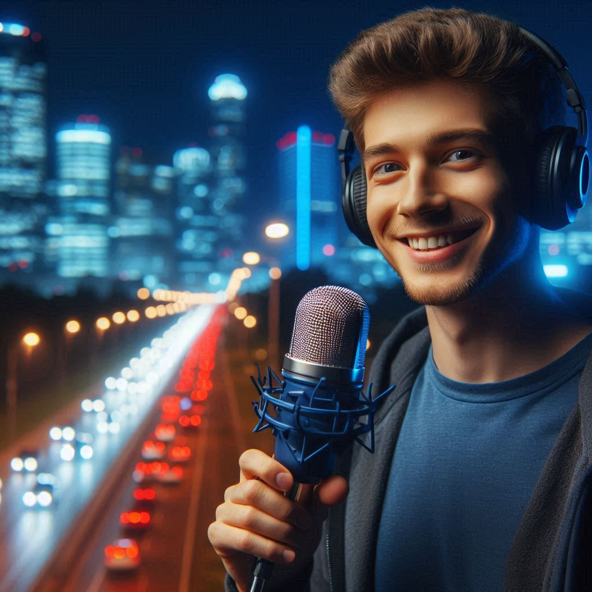

    preview do podcast

    <audio src="output/podcast-edit.mp3" controls title="Podcast editado"></audio>

# Projeto Podcast Gerado por I.A.s

## 💻 Tecnologias utilizadas no projeto

- [ChatGPT](https://chat.openai.com/) 
- [MidJourney](https://www.midjourney.com/app/)
- [ElevenLabs](https://beta.elevenlabs.io/)

## ✨ Como foi feito ?

- Roteiro gerado via chatgpt
- Audio gerado pela elevenLabs
- Midjourney Para gerar capas
- Adobe Premiere para tratamento de audio

---

⌨️ com 💜 por [Gabriel Elias](https://www.linkedin.com/in/gabriel-elias-silva)